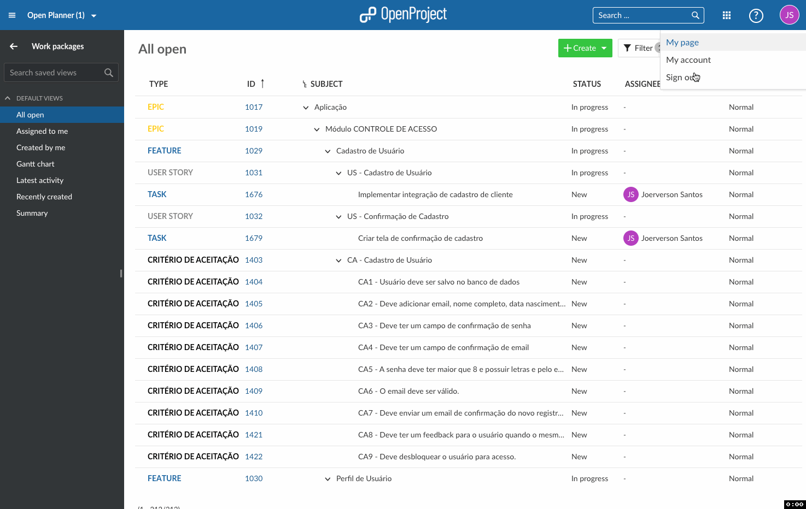

# AVIA

A
V
I
A

The script for easy create and update new branches with base the main branch.

# Minimum requirements 
- [GIT](https://git-scm.com/book/en/v2/Getting-Started-Installing-Git)

## Install Linux

to install copy the code in terminal

```
sh -c "$(curl -fsSL https://raw.githubusercontent.com/Joeverson/git-job/master/tools/install.sh)"
```

### Copy/Create the environment

```
export TOKEN=<token-open-project>
export BRANCH_UPLEVEL=<branch-default-development>
export SERVER_OP=<ip-open-project>
export PROJECT_ID=<id-project>
```

## Runner

Copy the application for ./bin or choose one local, after call the command in terminal into in your project with git:

```avia <id_task> [branch-default]```

## commands

For more informations

```
$ avia --help
```

# Timer

When task start, you can add pause, resume oor stop the timer, so call the command.
```
$ avia [--pause || p] [--resume || r] [--stop || s]
```
When stop timer your spend time is saved in open project.

# How get token in Open Project

is simple, see the gif:

